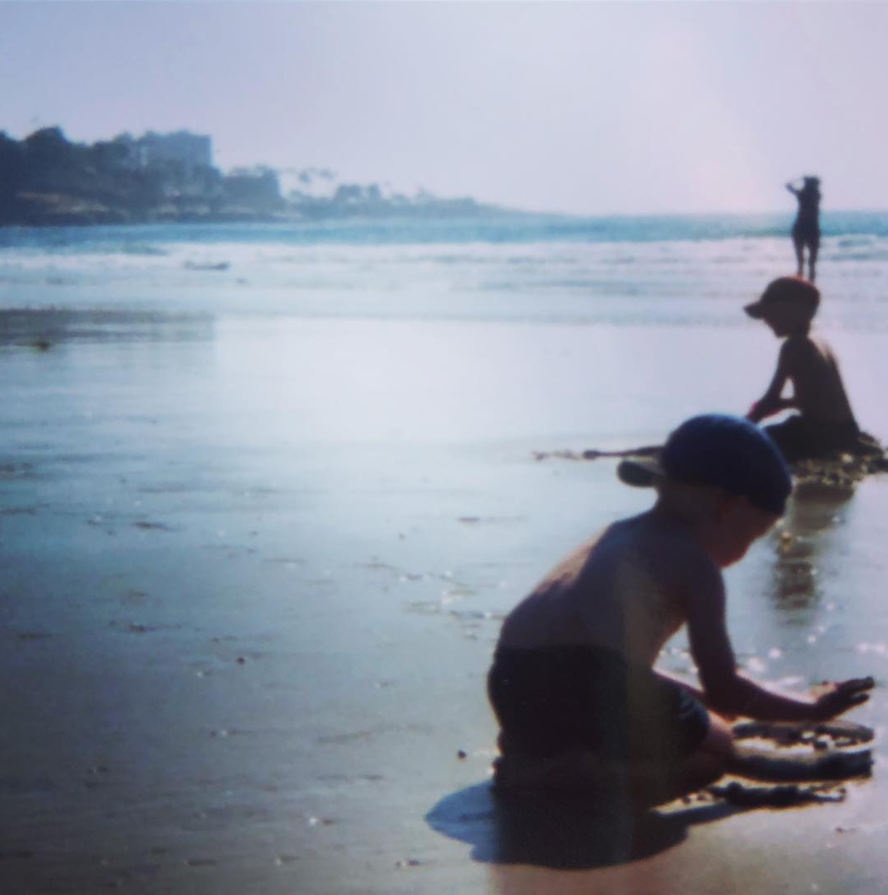
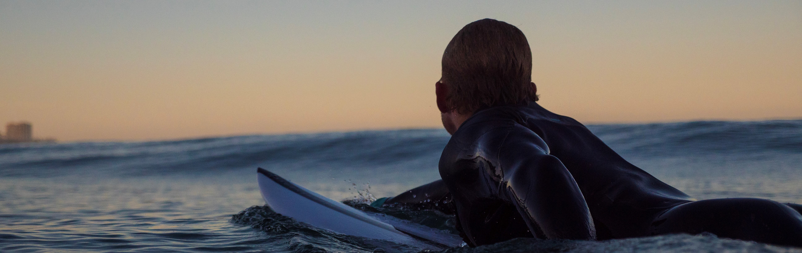
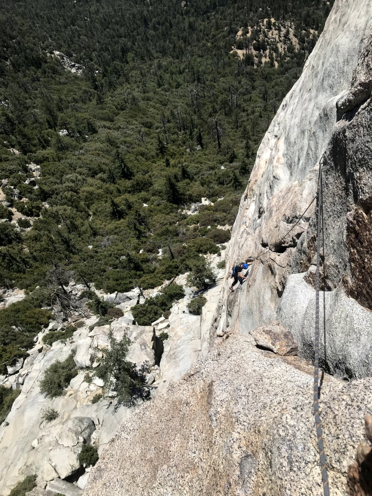
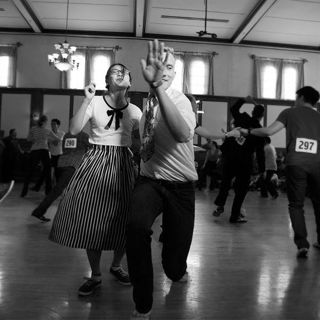

### Why I became a scientist
(and how I got to where I am today)

Growing up near the Puget Sound in Seattle, Washington I always felt a magnetic pull towards the ocean. Each year, my mom and I would look up the tide charts and circle those days on the calendar where the tides were going to be **super** low. I always knew on those days I'd see something truly awesome. From giant sunflower sea stars (*Pycnopodia helianthoides*) to giant green sea anenomes (*Anthopleura xanthogrammica*) these "giants" of the Pacific Northwest were even larger in my childhood imagination. 

My favorite book as a young child was Davy's Dream by Paul Owens Lewis. The boy in the book dreams of one day sailing with orcas---a dream that quickly became my own. And while I did finally manage to go see orcas up in the San Juan Islands, as I grew up, my dream morphed into an intense desire to study and understand the natural world. 

This led me to get a B.S. in Biology at the University of California, San Diego, quickly followed by a M.S. in Biology. During my masters I studied both honey bee and stingless bee behavior and was fortunate enough to spend six months in Tapachula, Mexico. After countless bee stings and one or two Modelos after a long day of field work, I eventually transitioned into a PhD program at Scripps Institution of Oceanography. And while my journey has taken the ocassional unforseen turn, I always feel lucky that I ended up at a place that feels like my childhood daydreams come to life. 

My brother and I exploring the infauna of La Jolla Shores, I am sure I was thinking "Hmmm this seems like a fine place to do a PhD!"

### When I am not science-ing...

My love of the natural world extends beyond my working life.

Any time there is swell here in San Diego you'll likely find me paddling out at Blacks Beach in the early morning light. Nothing can beat a dawn patrol session as the sun begins to peak over the cliffs. Always making sure to jog back over the rocky intertidal, showering and grabbing a coffee before settling down for a day of coding, meetings, and conversations with fellow grad students. Although let's be real... if the swell is **really** good I might push a morning meeting an hour back. 

When the swell goes flat or the wind turns onshore you'll find me climbing on the rocks around San Diego and beyond. While a relatively new hobby for me, climbing perfectly blends my love of the outdoors and athletics. Just as in surfing there's something exhilarating about pushing your physical limits in the face of the jaw-dropping and sometimes scary things nature can throw your way. 

And finally, my hobby for when I have truly and finally run out of hours in the day to spend outdoors...swing dancing. Growing up as a kid who played every sport I could sign up for, I never would have imagined that swing dancing would become such an important component of my life. From driving up 2-3 times a week during my master's program to compete with a team in Orange County, to teaching every few months at the Firehouse Swing Dance in San Diego, swing dancing is a passion I will carry with me for the rest of my life. There are few things in life that can match the utter joy of dancing with a complete stranger and instantly connecting to the music and each other. 

